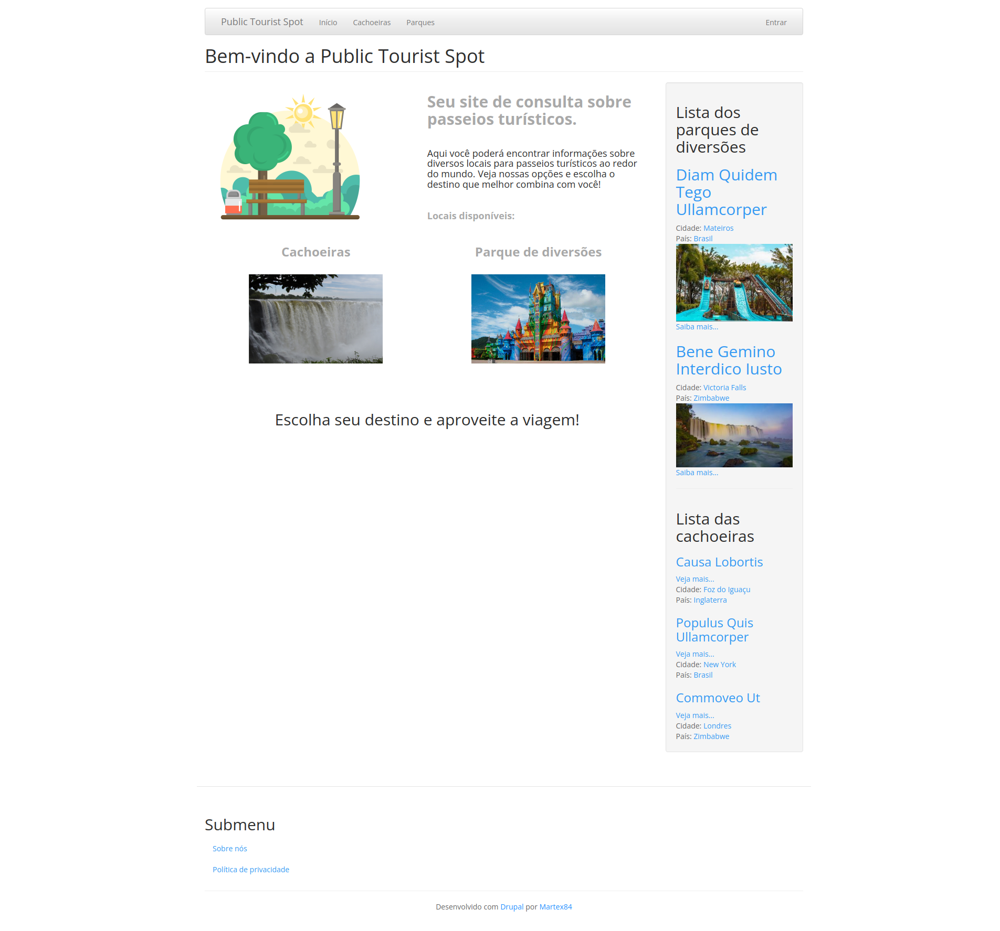
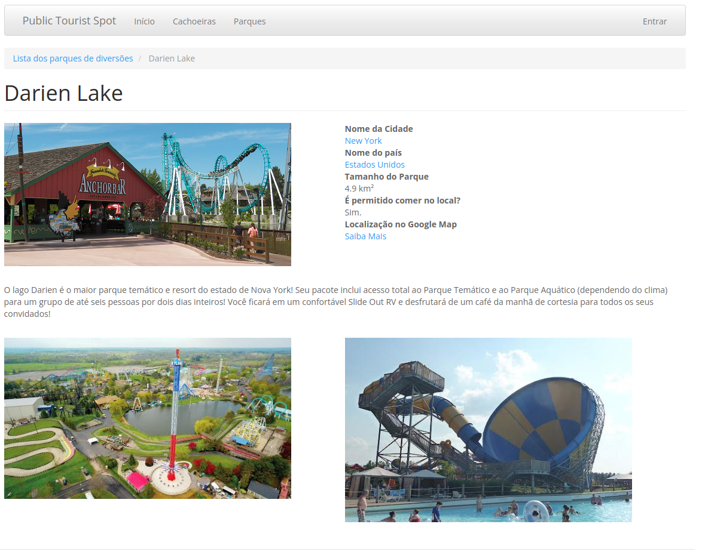
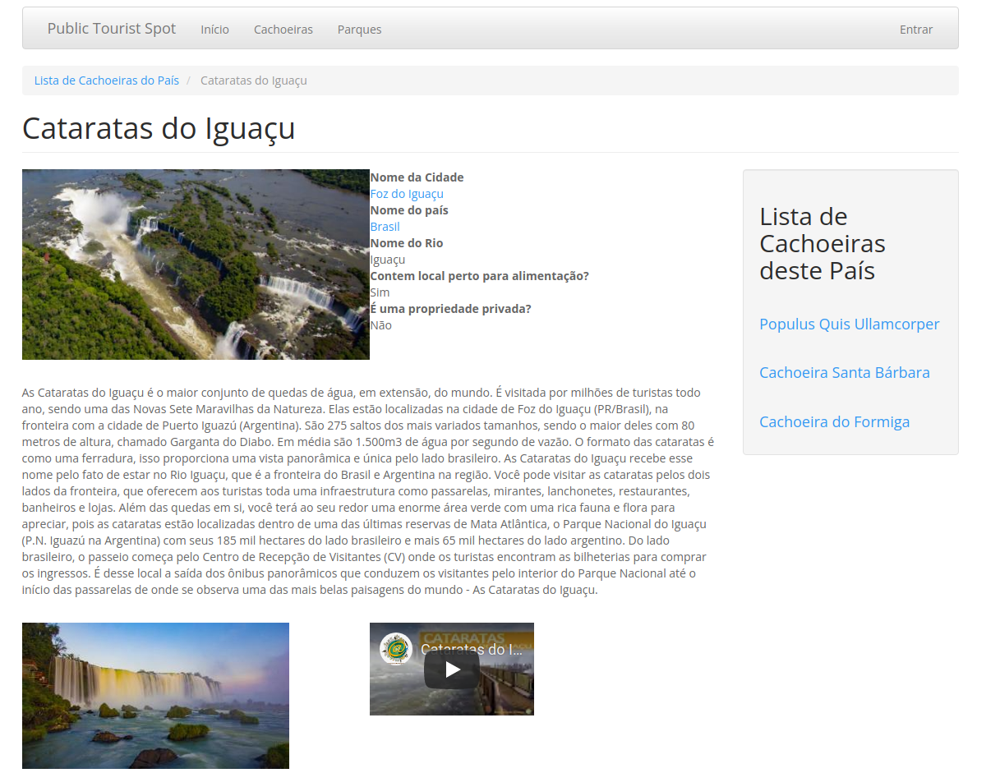

# Projeto site “Public Tourist Spot” com Drupal

O projeto tem como finalidade a criação de um site de turismo, com conteúdo primário, cachoeiras e parques de diversões, utilizando como ferramenta o Drupal;
   
## Dependências e Módulos do Drupal
- Admin Toolbar;
- Pathauto;
- CTools;
- Token;
- Devel;
- Drush;
- Bootstrap;
   
## Pastas e Arquivos Especiais
- Config: Responsável por armazenar as configurações do drupal;
- Database: Responsável por armazenar o banco de dados com os dados do drupal
- Scriptconfig: Responsável por automatizar os códigos de armazenamento do config e da database, pelo Lando/Drush;
   
## Instalação
1. Instale o Lando na máquina;
2. Realize a clonagem da última versão deste github e entre na pasta;
3. Utilize o comando a seguir para criar o docker local:
> lando start
4. Utilize o código a seguir com o composer para instalar as dependências e o core do Drupal:
> lando composer install
5. Utilize o código a seguir para instalar a configuração no database, importando o arquivo dentro da pasta "database":
> lando db-import ./database/database.sql.gz
6. Utilize o código a seguir para pegar o link referente ao site, entre no mesmo e prossiga com a instalação:
> lando info
7. Utilize a seguinte configuração na parte referente ao database:
> Nome BD: drupal9  
> Usuário BD: drupal9  
> Senha BD: drupal9  
> Servidor BD: database  
8. Clique no link "site atual";
   
## Bugs e suas soluções
- Bug referente ao admintoolbar onde tudo fica em listas:
> Caso ocorra algum erro de tema quando conectar com administrador, deve seguir para link a seguir e habilitar o tema default para “área de administração”:  
> **/admin/appearance**
   
## Contato Desenvolvedor
- Nome: Marcelo TJ
- Apelido: martex84
- Linkdl: [link](https://www.linkedin.com/in/martex8/)
   
## Imagens
- Imagem da Home Page(Local:/Image/image_total_home-page.png)

  
- Imagem da Pagina de Parques de Diversões(Local:/Image/image_park-page.png)

  
- Imagem da Pagina de Cachoeiras(Local:/Image/image_waterfall-page.png)
